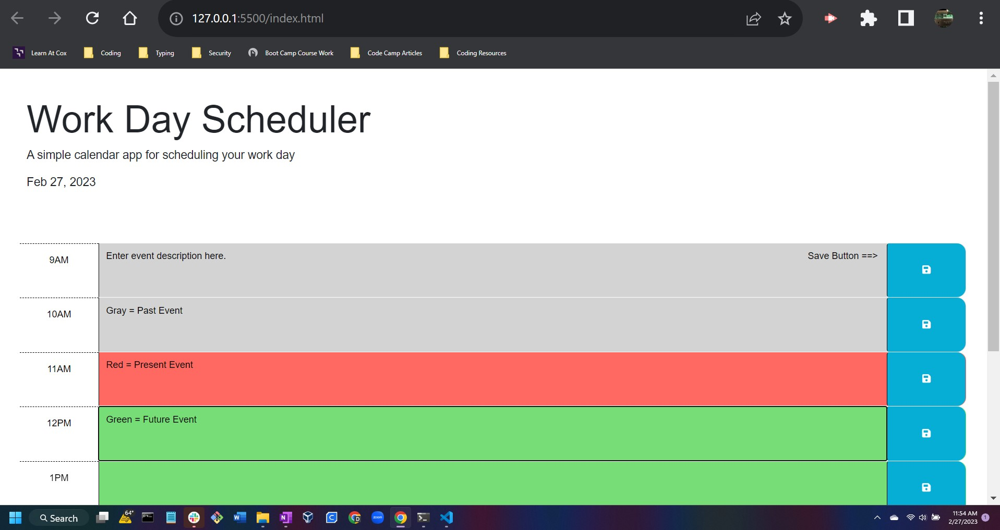

# Daily-Work-Planner-And-Scheduler

## Description

This project was created to help with user time management through out the working business day.  Allowing for a easy to use central spot to input events that needed to be remembered and tracked throughout the day.  In creating this project, I was able to learn more on 3rd party API's such as jQuery and Day.Js. I was also able to learn more on DOM manipulation and further solidify those skills.

## Table of Contents

- [Installation](#installation)
- [Usage](#usage)
- [Credits](#credits)
- [License](#license)

## Installation

This is a browserbased application.  No extra installation steps required.  Open in browser to begin using.

## Usage

To use the planner.  Open the application in your browser.  You will then be presented with a screen showing time slots from 9AM-5PM.  You will be able to enter your events and save them to local storage on the browser.  You are then free to close the page and return.  You events that you saved will still persist until you either remove or change them.

As the day progess the application will track wich hour you are on,  this will be displayed by the following color code:

past: gray
present: red
future: green

This are updated automatically as time passes.

## Credits

Startcode Repo URL:
https://github.com/coding-boot-camp/crispy-octo-meme

jQuery Documentation:
https://api.jquery.com/

Day.Js Documentation:
https://day.js.org/

## License
 MIT License

